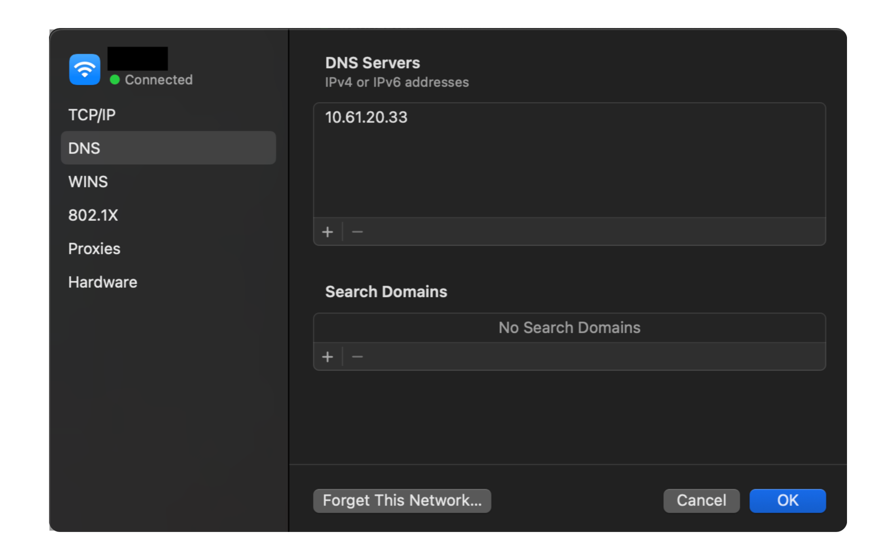

## Overview

This guide offers step-by-step instructions for configuring NoLoAD (NoMAD Login AD) on macOS, enabling users to log in with their Domain Accounts without binding the system directly to a specific Domain. NoLoAD provides a streamlined solution for seamless domain authentication on Mac devices.

:::caution[APU network specific configuration]
This guide and configuration are specifically designed for use on **Asia Pacific University (APU)'s Network**. The included configuration files, DNS settings, and domain references are all configured for APU's technical infrastructure. If you're setting up NoLoAD elsewhere, you'll need a different configuration.
:::

:::note
NoLoAD is ideal for educational and enterprise settings where centralized user management is needed. It enables domain logins on Macs, which cannot fully join Active Directory domains similar to Windows devices.
:::

## Prerequisites

- A Mac computer running macOS 10.12 (Sierra) or newer
- A working internet connection
- Access to the institution's network (either via WiFi or Ethernet connection)
- Basic familiarity with macOS

:::danger
Some steps in this installation may require administrator privileges on the Mac. If you don't have admin access, please contact your fellow TAs for assistance.
:::

## Installation Steps

### Step 0: Ensure the Device Can Connect to the Domain Controller

:::caution
Before installing NoLoAD, verify that your Mac can connect to the domain network. NoLoAD requires proper connectivity to function.
:::

1. **Check Network Connection**
   - Ensure your Mac is connected to the **"IOT@APU" WiFi** network or via **Ethernet (LAN)**.
   - To verify WiFi: Click the WiFi icon in the menu bar and confirm "IOT@APU" is selected.
   - For Ethernet: Confirm the cable is securely connected to both the Mac and the network port.

2. **Verify Domain Controller Connectivity**
   - Open **Terminal** (Applications > Utilities > Terminal, or use ⌘+Space and search for "Terminal").
   - Run:
     ```bash
     nslookup techlab.apiit.edu.my
     ```
   - If the domain is resolving correctly, you should see its corresponding IP address in the output.

3. **If Domain Resolution Fails:**
   - Go to **System Preferences** (or **System Settings** in newer macOS versions)
   - Navigate to **Network**
   - Select your active interface (WiFi or Ethernet)
   - Click **Advanced...**, go to the **DNS** tab
   - Add the DNS server: `10.61.20.33`
   - Click **OK** > **Apply**

   

   *Fig 1: Adding APU's DNS server in macOS Network settings*

:::danger
Incorrect DNS settings will prevent your Mac from locating the domain controller, causing NoLoAD setup to fail.
:::

---

### Step 1: Download and Install NoLoAD

:::caution
If you're using system restore solutions like **Deep Freeze** or similar, you must **temporarily disable** them before installing NoLoAD or making any configuration changes. Once setup is complete and verified, you may re-enable the restore protection. Failure to do so may cause configuration loss after a reboot.
:::

1. **Download the Installer**
   [Download NoLoAD](https://cloudmails-my.sharepoint.com/:f:/g/personal/abdulla_meesum_cloudmails_apu_edu_my/Egu45iVTsFhIig7rMZiTSvIB6W8RVw7TvMUt3vDUnFLt3g?e=ENgZPc) (NoMAD-Login-AD.pkg) from the shared OneDrive folder and save it (typically in the **Downloads** folder).

2. **Run the Installer**
   - Open **Finder**, go to **Downloads**, and double-click `NoMAD-Login-AD.pkg`.
   - If you see a security warning:
     - Right-click the file > **Open** > confirm with **Open**.
   - Follow the installation prompts:
     - Click **Continue** through the steps.
     - Choose your main drive and click **Install**.
     - Enter your admin password when prompted.

:::note
Installation may take a few minutes. Avoid interrupting the process.
:::

---

### Step 2: Install the Configuration Profile

1. **Download the Configuration File**
   [Download `.mobileconfig` file](https://cloudmails-my.sharepoint.com/:f:/g/personal/abdulla_meesum_cloudmails_apu_edu_my/Egu45iVTsFhIig7rMZiTSvIB6W8RVw7TvMUt3vDUnFLt3g?e=ENgZPc) from the shared OneDrive folder

2. **Install the Profile**
   - Locate the file in **Downloads** and double-click it.
   - System Preferences (or System Settings) will open to **Profiles**.
   - Click **Install**, authenticate if prompted, and confirm any warnings.

:::danger
If installation doesn't start automatically, go to System Preferences > **Profiles** (or Settings > Privacy & Security > Profiles), click **+**, and add the downloaded file manually.
:::

---

### Step 3: Set Up the Lockscreen Assets

1. **Download Assets**
   [Download lockscreen ZIP](https://cloudmails-my.sharepoint.com/:f:/g/personal/abdulla_meesum_cloudmails_apu_edu_my/Egu45iVTsFhIig7rMZiTSvIB6W8RVw7TvMUt3vDUnFLt3g?e=ENgZPc) from the shared OneDrive folder

2. **Extract the ZIP**
   - Double-click the file in **Downloads** to extract the `LoginScreen` folder.

3. **Copy Assets to System Folder**
   - Open **Terminal**, then run:
     ```bash
     sudo mkdir -p /Library/LoginScreen
     sudo cp -r ~/Downloads/LoginScreen/* /Library/LoginScreen/
     ```

4. **Set Correct Permissions**
   - In Terminal:
     ```bash
     sudo chmod -R 755 /Library/LoginScreen
     ```

   **Alternatively via Finder:**
   - Press ⌘+Shift+G in Finder, type `/Library`, and click **Go**.
   - Right-click `LoginScreen` > **Get Info**
   - Click the lock icon, enter your password, and set permissions to **Read & Write** for all users.
   - Click the gear icon > **Apply to enclosed items**

:::caution
Improper permissions may prevent the login screen from displaying correctly.
:::

## Post Setup Steps

### Verify Installation

1. Save any open work and log out of your current user account:
   - Click the Apple menu (top left corner) and select "Log Out [Username]"
   - Or use the keyboard shortcut **⌘+Shift+Q**

2. At the login screen, you should now see the customized NoLoAD login interface instead of the standard macOS login screen.

3. To test domain authentication:
   - Enter your domain username in one of the following formats:
     - username@techlab.apiit.edu.my
     - or simply username (the domain has already been configured in the configuration file)
   - Enter your domain password
   - Click the "Log In" button or press Return

:::note
Domain accounts logged into the Mac will remain stored locally on the machine, even after logout — just like on Windows. These accounts will persist until manually deleted.
:::

:::note[Troubleshooting]
If the custom login screen doesn't appear or domain authentication fails:
- Restart your Mac to ensure all changes take effect
- Verify your network connection and DNS settings
- Check that the NoLoAD service is running by opening Terminal and typing: `sudo launchctl list | grep NoMAD`
- If issues persist, you might need to reinstall the NoLoAD package
:::

### Managing Domain User Profiles

Over time, a Mac with NoLoAD may accumulate multiple domain user profiles. For maintenance or troubleshooting purposes, you may need to remove these profiles.

:::danger
Both methods permanently remove user accounts and their associated data from the Mac. Ensure any important files are backed up before proceeding.
:::

#### Automated Removal Method

1. **Download the Removal Script**
   - [Download the `remove_ad_users.sh` script](https://cloudmails-my.sharepoint.com/:f:/g/personal/abdulla_meesum_cloudmails_apu_edu_my/Egu45iVTsFhIig7rMZiTSvIB6W8RVw7TvMUt3vDUnFLt3g?e=ENgZPc) from the shared OneDrive folder

2. **Run the Script to Remove Domain Users**
   - Open **Terminal** (Applications > Utilities > Terminal)
   - Navigate to your Downloads folder:
     ```bash
     cd ~/Downloads
     ```
   - Make the script executable:
     ```bash
     chmod +x remove_ad_users.sh
     ```
   - Run the script with admin privileges in one of two modes:

     **Dry Run Mode** (safely preview changes without making them):
     ```bash
     sudo ./remove_ad_users.sh --dry-run
     ```

     **Normal Mode** (actually remove users):
     ```bash
     sudo ./remove_ad_users.sh
     ```

   - The script will:
     1. Scan and identify all Active Directory (AD) users on the Mac
     2. Display a list of all found AD users with their account names
     3. Ask for confirmation before proceeding
     4. If confirmed, remove all AD user accounts and associated data:
        - User account entries
        - Home directories
        - System preference files
        - Application caches
        - Temporary files
        - Various user-related data throughout the system

#### Manual Removal Method

If you prefer to remove domain users manually:

1. **Open System Preferences/Settings**
   - Click the Apple menu (top left) and select "System Preferences" (or "System Settings" in newer macOS)
   - Navigate to "Users & Groups"

2. **Unlock the Preference Pane**
   - Click the lock icon in the bottom left corner
   - Enter your administrator credentials when prompted

3. **Remove Domain User Accounts**
   - Select the domain user account you wish to remove from the list on the left
   - Click the minus (-) button below the list
   - In the dialog that appears, choose one of the options:
     - **"Delete the home folder"** (removes all user data, recommended)
     - "Save the home folder in a disk image" (preserves data)
     - "Don't change the home folder" (leaves data intact)
   - Click "Delete User"

4. **Repeat as Needed**
   - Follow the same process for each domain user account you want to remove

:::note
Removing user profiles periodically on lab computers helps maintain system hygiene and free up disk space.
:::

---

## Uninstallation (If Needed)

If you need to uninstall NoLoAD for any reason:

1. Download the [uninstall script](https://cloudmails-my.sharepoint.com/:f:/g/personal/abdulla_meesum_cloudmails_apu_edu_my/Egu45iVTsFhIig7rMZiTSvIB6W8RVw7TvMUt3vDUnFLt3g?e=ENgZPc) from the shared OneDrive folder
2. Open Terminal (Applications > Utilities > Terminal)
3. Navigate to where you downloaded the script:
   ```bash
   cd ~/Downloads
   ```
4. Make the script executable and run it:
   ```bash
   chmod +x Uninstall-NoLoAD.sh
   sudo ./Uninstall-NoLoAD.sh
   ```
5. Restart your Mac after the uninstallation completes

:::danger
Uninstalling NoLoAD will revert your Mac to the standard login system. Domain users may no longer be able to log in without additional configuration.
:::
